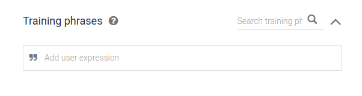
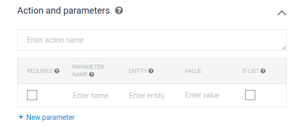

# TUTORIEL DIALOGFLOW

La page principale:

### LES INTENTS

Les intents sont la base de Dialogflow, c'est là que vous allez définir les choses que votre ChatBot dit et ses attentes par rapport aux réponses que l'utilisateur donnera.

Le processus de création d'intents basique est assez facile, lorsque vous crééz un intent, nommez le. (essayez de suivre une nomenclature claire et précise, ex: "Chatbot-Aide-Reservation-Classe").

#### LES TRAINING PHRASES

Les training phrases, ce sont les phrases auxquelles le bot réagira, essayez d'en définir assez pour que le bot puisse prendre en compte la plupart des possibilités, inutile de mettre des phrases entières, des mots clés suffisent.
("Je voudrais réserver une salle" seraît donc plutôt "réservation", "réserver salle", "réservation salle", etc...)
Essayez d'en ajouter entre 5 et 10 pour chaque intent, au moins.

#### LES REPONSES

Les réponses, comme le nom l'indique, ce sont les réponses renvoyées par le chatbot lorsque une des training phrases a été déclenchée. Comme pour les training phrases, essayez d'ajouter une multitude de réponses, ça donnera un air plus 'naturel' au bot.
Pas la peine de toucher à l'onglet Google assistant pour le moment.
Si vous voulez que cet intent soit la fin de la discution, cochez le bouton "Set this intent as end of conversation".

#### LES ACTIONS ET PARAMETRES

Les actions et paramètres permettent d'attendre un certain type de réponse de la part de l'utilisateur et de ne pas avancer dans la discution tant que cette réponse (ou type de réponse) n'est pas entrée. (Contrairement aux training phrases qui prennent n'importe quel type de réponse.)
Les actions et paramètres, couplés aux entités, permettent de récupérer la réponse donnée en forme de variable.

Vous pouvez définir une action comme requise si vous voulez que la discution stagne et le bot repose la même question tant qu'une certaine réponse n'est pas donnée, si non, n'importe quelle réponse sera prise en compte.

Avant de continuer, une petite introduction aux Entités.

#### LES ENTITES

Les entités sont des variables prédéfinies, généralement des mots-clés, avec des synonymes, qui permettent de les utiliser dans les Action et Paramètres en tant que variables requises dans la réponse de l'utilisateur.

Lorsque vous créez une entité, nommez là de manière claire et concise, puis, définissez une valeur et ses synonymes. Reprenons notre exemple sur le booking d'une room, imaginons que vous voulez que l'utilisateur rentre le nom de la room qu'il veut booker. Voici à quoi ressemblerait votre entité.

#### Revenons en aux Action et Parametres.

Nommons notre action en rapport avec ce qu'elle fait, dans notre cas c'est roomBooking.
Mettons le en required, le nom du paramètre sera roomName, donnez lui l'entité que vous venez de créer, donc @roomName, définissez le nom de la valeur, prenons $room (le @ et le $ pour l'entité et la valeur est nécessaire). Ignorons le IS LIST.

Jusqu'ici votre action devrait ressembler à ça :

Le prompt permet de définir la question(ou la phrase) que le bot va poser pour récupérer la variable.
Le prompt est similaire aux training phrases. Mettons en 4.

#### LES FOLLOWUP INTENTS

Les followup intents sont des intents normaux qui en suivent d'autres, pour donner l'impression d'avoir une discution qui s'enchaine. Pour en créer un, mettez la souris sur l'intent pour lequel vous voudriez créer une suite, et cliquez sur "Add follow-up intent".

Il y a une multitude de followups déjà faits, tels que "Oui", "Non", etc...
Si vous voulez un followup intent vide pour pouvoir le customiser à votre guise, cliquez sur 'custom'
Choisissez celui que vous voulez et c'est fait, vous avez votre followup.

#### LES TESTS

Vous pouvez tester vos intents directement sur la page, en haut a droite vous avez la zone de test.

#### LE RESTE

Pour le reste, voyez la documentation google. (Si vous faites beaucoup de followup intents, faites attention au lifespan, ou la durée de vie des variables, elles peuvent causer porblème.)
